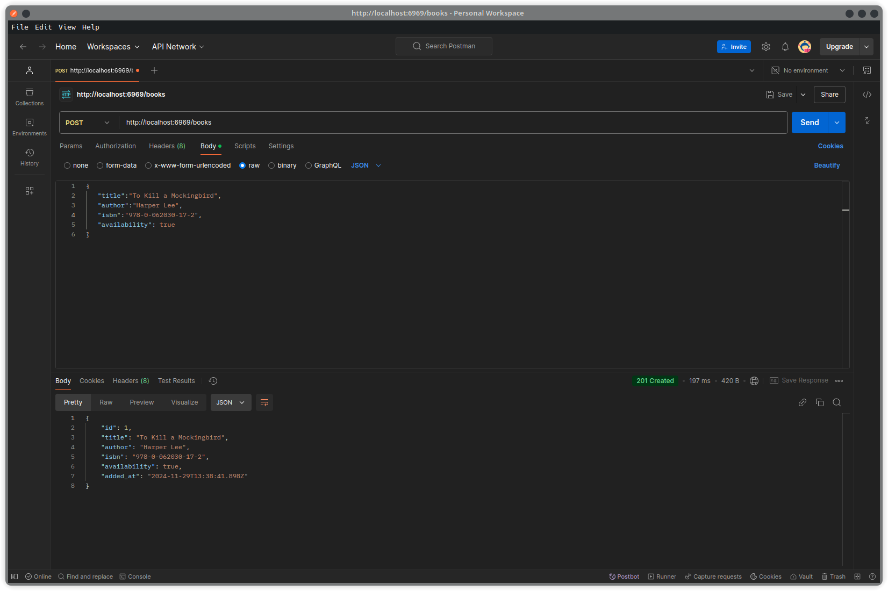
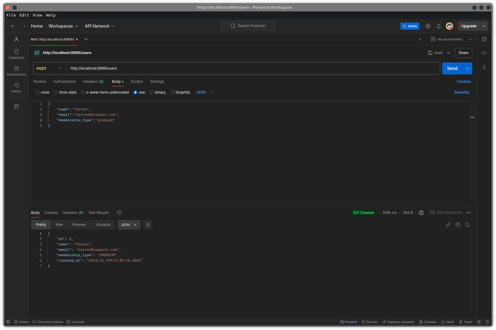
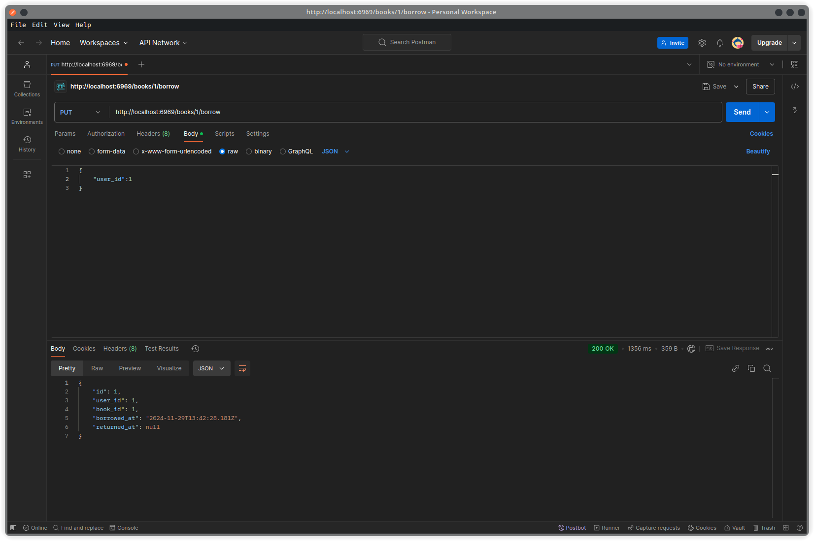
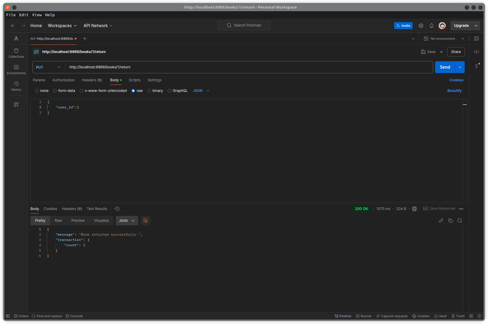
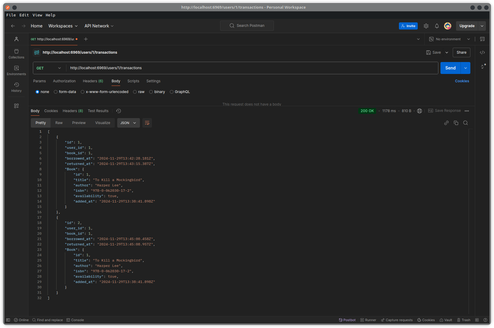

# Library Management System API

A simple RESTful API for managing users, books, and transactions in a library system. This application is built with Node.js, Express.js, and Prisma as the ORM.

## API Endpoints

### 1. Add a New Book

- Endpoint: **POST** /books
- Description: Add a new book to the library collection.
- Request Body:

```json
{
  "title": "Book Title",
  "author": "Author Name",
  "isbn": "123-456",
  "availability": true
}
```

- **Example**
  

### 2. Register a New User

- Endpoint: **POST** /users
- Description: Register a new user with their details and membership type.
- Request Body:

```json
{
  "name": "User Name",
  "email": "<user@example.com>",
  "membership_type": "premium"
}
```

- **Example**
  

### 3. Borrow a Book

- **Endpoint: PUT /books/:id/borrow**
- **Description: Borrow a book by specifying the user borrowing it.**
- **Path Parameter:**
  - id (integer) – The book's ID.
- **Request Body:**

```json
{
  "user_id": 1
}
```

- **Example**
  

### 4. Return a Book

- Endpoint: **PUT** /books/:id/return
- Description: Mark a book as returned.
- Path Parameter:
  - id (integer) – The book's ID.
- **Request Body:**

```json
{
  "user_id": 1
}
```

- **Example**
  

### 5. Fetch Transaction History

- Endpoint: **GET** /users/:id/transaction
- Description: Retrieve the borrowing history of a specific user.
- Path Parameter:
- id (integer) – The user's ID.

- **Example**
  

## Setup Instructions

### Prerequisites

- Node.js (v16 or higher)
- npm or pnpm (preferred)
- PostgreSQL database

### Steps to Set Up

**1. Clone the Repository**

```bash
git clone https://github.com/Ponraaj/celestius-assessment.git
cd celestius-assessment
```

**2. Install Dependencies**

```bash
pnpm install
```

**3. Set Up the Database**

- Create a PostgreSQL database.
- Update the .env file with your database URL:

```env
 DATABASE_URL=postgresql://<user>:<password>@<host>:<port>/<database>
```

**4. Run Prisma Migrations**

- Generate the database schema:

```bash
pnpx prisma migrate dev --name init
```

**5. Start the Server**

```bash
pnpm dev
```
